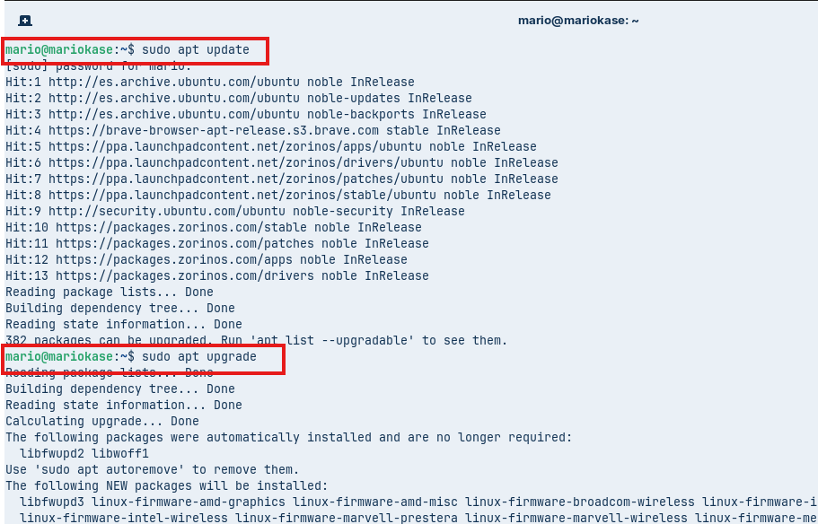
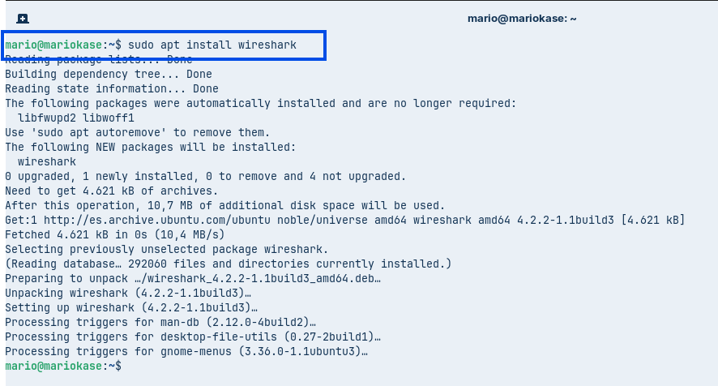

# Mario González - AA2 Avaluació Server DHCP


##  Eines utilitzades a l'Activitat

* **Zorin OS:** Màquina virtual client que sol·licita i rep la IP per DHCP.
* **Netplan:** Eina de configuració de xarxa per assignar la IP estàtica al servidor.
* **Kea DHCP:** Servei de DHCPv4 modular de darrera generació.
* **Ubuntu Server 24.04/Linux:** Servidor encarregat de gestionar el servei DHCP.
* **Wireshark:** Analitzador de paquets de xarxa per capturar la negociació DORA.

---

##  Desenvolupament de la Pràctica Pas a Pas

### 1. Preparació de Wireshark al Client

Per poder capturar el trànsit de xarxa durant la negociació DHCP, primer hem preparat la màquina client instal·lant l'eina Wireshark amb les següents comandes:

```bash
sudo apt update
sudo apt upgrade
sudo apt install wireshark
```




Al instal·lar el paquet `wireshark-common`, el sistema pregunta si volem permetre que els usuaris no superusuaris puguin capturar paquets. Seleccionem l'opció **Sí**.


Un cop instal·lat, iniciem l'aplicació des de la terminal per comprovar que la interfície gràfica s'obre correctament amb la comanda:

```bash
sudo wireshark
```


---

### 2. Configuració de les interfícies de xarxa al Servidor

El servidor Ubuntu compta amb dues interfícies de xarxa:
* **`enp0s3` (Adaptador 1)**: Mode **NAT** per mantenir la connexió a Internet.
* **`enp0s8` (Adaptador 2)**: Mode **Xarxa Interna** per donar servei DHCP a la xarxa local.

Comprovem l'estat inicial de les interfícies i la taula de rutes:

```bash
whoami
sudo whoami
hostname
ip -br link
ip -4 -br addr
ip route
```


Després, editem el fitxer de configuració de Netplan (`/etc/netplan/50-cloud-init.yaml`) per configurar la nostra propia adreça ip:

```bash
ls /etc/netplan
sudo netplan get
sudo nano /etc/netplan/50-cloud-init.yaml
```


**Configuració establerta a Netplan:**

```yaml
network:
  version: 2
  renderer: networkd
  ethernets:
    enp0s3:
      dhcp4: true
    enp0s8:
      dhcp4: false
      addresses:
        - 192.169.13.1/24
```

Apliquem els canvis i verifiquem que la interfície `enp0s8` ha agafat la IP `192.169.13.1/24` correctament amb les següents comandes:

```bash
sudo netplan apply
ip -4 -br addr
ip route
getent hosts ubuntu.com
```


---

### 3. Instal·lació i configuració del servei Kea DHCP

Al servidor Ubuntu instal·lem el paquet del servidor Kea DHCP4:

```bash
sudo apt install kea
```

Verifiquem la versió de Kea instal·lada i els serveis actius:

```bash
kea-dhcp4 -v
systemctl list-unit-files 'kea*'
```


Editem el fitxer de configuració principal del servei (`/etc/kea/kea-dhcp4.conf`):

```bash
ls /etc/kea
sudo nano /etc/kea/kea-dhcp4.conf
```


---

### 4. Validació, arrencada i comprovació de logs del servei

Abans d'iniciar el servidor, hem de comprovar que la sintaxi JSON del fitxer de configuració sigui correcta:

```bash
sudo kea-dhcp4 -t /etc/kea/kea-dhcp4.conf
```


Quan el test ens dona el resultat `INFO` és correcte, reiniciem el servei, l'habilitem per a l'arrencada automàtica i verifiquem que està actiu:

```bash
sudo systemctl restart kea-dhcp4-server
sudo systemctl enable kea-dhcp4-server
sudo systemctl status kea-dhcp4-server --no-pager
```


Per finalitzar, comprovem els logs del servei amb `journalctl` per verificar que realment està escoltant a la interfície `enp0s8` i ha carregat la subxarxa `192.169.16.0/24`:

```bash
sudo journalctl -u kea-dhcp4-server -b -e --no-pager -n 16
```


---
